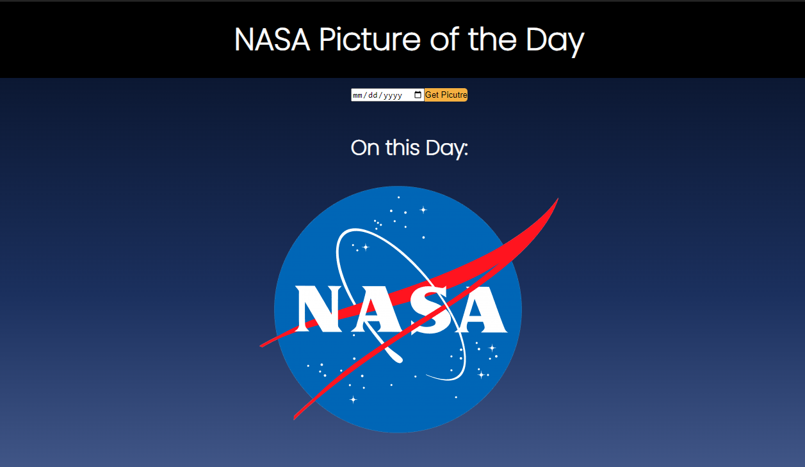

# nasa-api

## Description

This app can be used to view NASA's official picture of the day. It utilizes the API NASA offers to fetch the data and displays it using HTML, CSS, and JavaScript.

## Useage

Select a date on the date selector to view the picture of the day from that specific date! A picture and a description of it will appear.

deployed site: https://nasaapi-ec9o.onrender.com/
